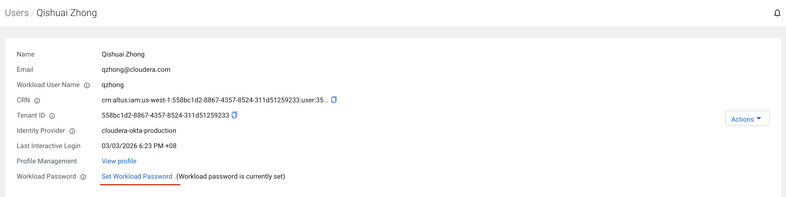
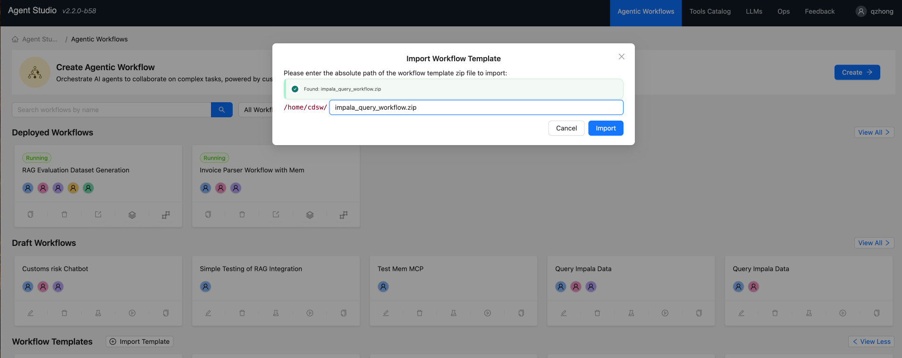
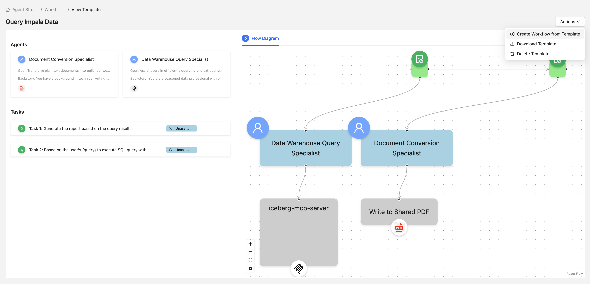
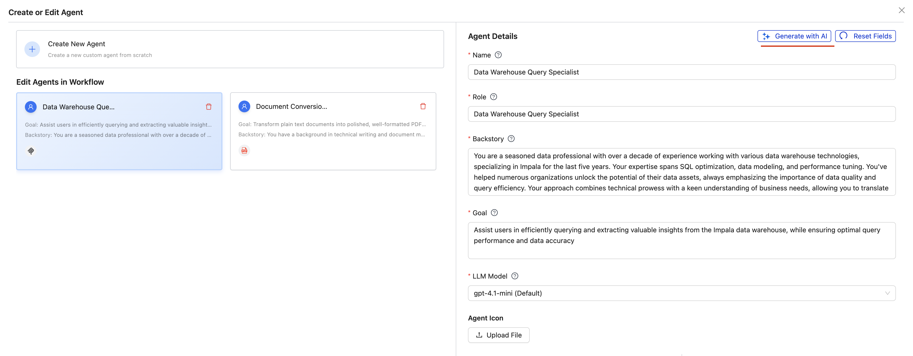
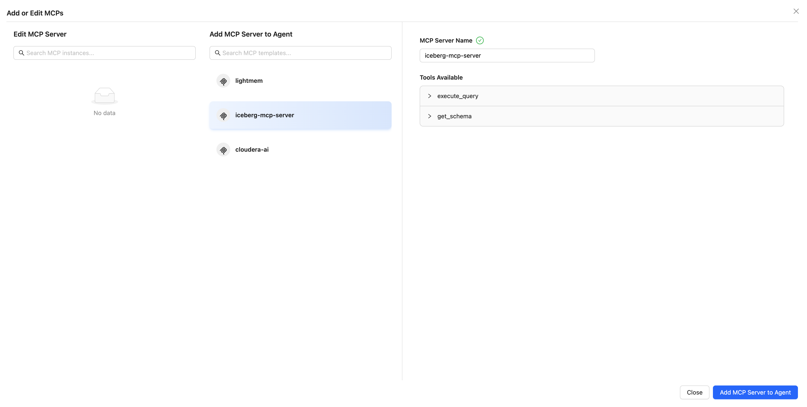
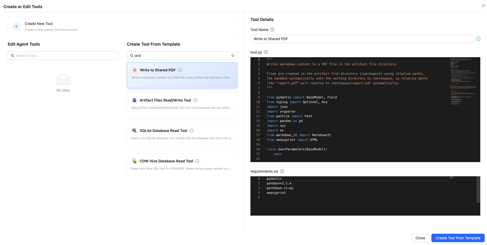
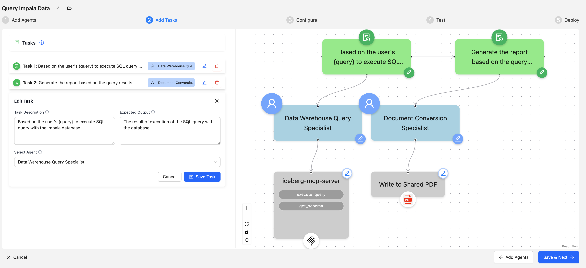
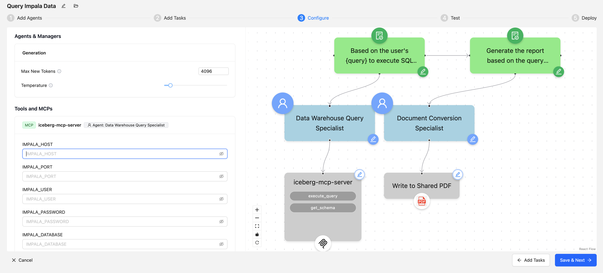
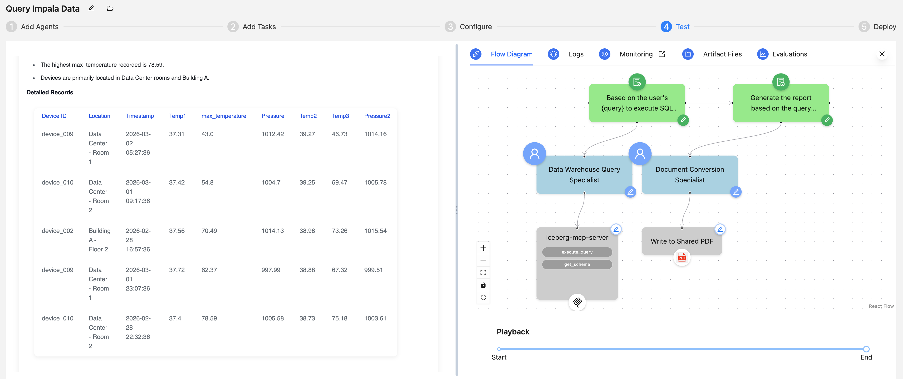
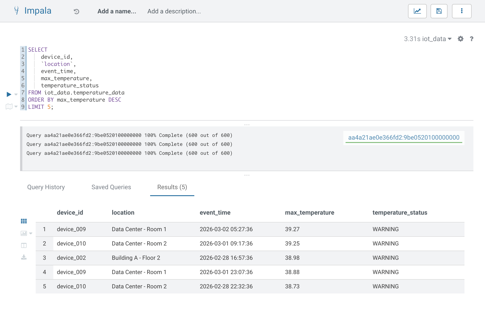

# Lab: Query Impala Data Workflow

## Overview

Build an agent workflow that enables natural language querying of an Impala data warehouse. The workflow uses two agents:
1. **Data Warehouse Query Specialist** - Executes SQL queries against Impala
2. **Document Conversion Specialist** - Generates formatted PDF reports

---

## Prerequisites

- Access to Cloudera AI Agent Studio
- Access to CDP Management Console
- A Data Hub with Impala service running

---

## Part 1: Set Up Workload Password

### Step 1.1: Set Workload Password

1. In **CDP Management Console**, click your username (bottom-left) > **Profile**
2. Under **Workload Password**, click **Set Workload Password**
3. Create and save your password



### Step 1.2: Note Connection Details

| Configuration | Value |
|---------------|-------|
| **Impala Host** | `Hue-impala-gateway.datalake.<environment>.cloudera.site` |
| **Port** | `443` |
| **User** | Your workload username |
| **Password** | Your workload password |
| **Database** | `iot_data` |

---

## Part 2: Register the Iceberg MCP Server

1. In Agent Studio, go to **Tools Catalog** > **MCP Servers** > **Register**
2. Paste the MCP server configuration from [cloudera/iceberg-mcp-server](https://github.com/cloudera/iceberg-mcp-server):

```json
{
  "mcpServers": {
    "iceberg-mcp-server": {
      "command": "uvx",
      "args": [
        "--from",
        "git+https://github.com/cloudera/iceberg-mcp-server@main",
        "run-server"
      ],
      "env": {
        "IMPALA_HOST": "placeholder",
        "IMPALA_PORT": "443",
        "IMPALA_USER": "placeholder",
        "IMPALA_PASSWORD": "placeholder",
        "IMPALA_DATABASE": "default"
      }
    }
  }
}
```

3. Click **Register** (use placeholder values - actual credentials are entered later)

---

## Part 3: Build the Workflow

### Step 3.1: Import the Workflow Template

1. Go to **Agentic Workflows** > **Import Template**
2. Enter path: `/home/cdsw/query_impala_data_workflow.zip`
3. Click **Import**



### Step 3.2: Create Workflow from Template

Click the imported template to create a new workflow.



---

## Part 4: Configure the Agents

### Step 4.1: Configure Data Warehouse Query Specialist

Click edit on the **Data Warehouse Query Specialist** agent. Note how AI can generate agent properties (Role, Backstory, Goal) from just the agent name.



### Step 4.2: Add MCP Server to Agent

1. Click **+ Add MCP Server to Agent**
2. Select **iceberg-mcp-server**
3. Available tools: `execute_query`, `get_schema`
4. Click **Add MCP Server to Agent**



### Step 4.3: Add Tool to Document Conversion Specialist

1. Click edit on the **Document Conversion Specialist** agent
2. Click **+ Create or Edit Tools**
3. Search for "write", select **Write to Shared PDF** template
4. Click **Create Tool from Template**



---

## Part 5: Configure Tasks

Review the pre-configured tasks in the **Tasks** section:



| Task | Description | Agent |
|------|-------------|-------|
| Execute SQL Query | Based on the user's `{query}` to execute SQL query with the impala database | Data Warehouse Query Specialist |
| Generate Report | Generate the report based on the query results | Document Conversion Specialist |

---

## Part 6: Configure MCP Server Variables

1. Click **Configure** in the workflow editor
2. Under **Tools and MCPs**, find `iceberg-mcp-server`
3. Enter your actual connection details:



| Variable | Value |
|----------|-------|
| **IMPALA_HOST** | Your Impala coordinator host |
| **IMPALA_PORT** | `443` |
| **IMPALA_USER** | Your workload username |
| **IMPALA_PASSWORD** | Your workload password |
| **IMPALA_DATABASE** | `iot_data` |

> **Note:** Values are stored in browser local storage, not sent to Agent Studio backend.

---

## Part 7: Test the Workflow

### Step 7.1: Run Test Query

1. Click **Test** in the workflow editor
2. Enter a natural language query:
   ```
   find the top 5 records with the highest max_temperature
   ```
3. Click **Run**

### Step 7.2: Review Results



### Step 7.3: Verify with Direct Query (Optional)

Run the equivalent SQL in Hue to verify results:

```sql
SELECT device_id, `location`, event_time, max_temperature, temperature_status
FROM iot_data.temperature_data
ORDER BY max_temperature DESC
LIMIT 5;
```



---

## Part 8: Deploy the Workflow (Optional)

1. Click **Deploy** in the workflow editor
2. Configure deployment settings
3. The workflow becomes available as an API endpoint

---

## Troubleshooting

| Issue | Solution |
|-------|----------|
| MCP connection fails | Verify Impala host URL, workload password, port 443 accessibility |
| Query execution fails | Check table/column names, verify SELECT permissions |
| PDF tool fails | Recreate tool from template, check dependencies |

---

## Next Steps

- Add a third agent to upload reports to a CAI project
- Create a conversational version of this workflow
- Explore other MCP servers for different data sources
