# Lab: RAG Evaluation Workflow

## Overview

Build an agent workflow to evaluate a RAG (Retrieval-Augmented Generation) application. The workflow performs 5 sequential tasks:

1. **Generate Ground Truth** - Generate Q&A pairs from document content
2. **Verify Quality** - Validate and score the Q&A pairs
3. **Upload Document** - Upload to RAG Studio knowledge base
4. **Query RAG** - Query RAG with validated questions, collect responses
5. **Evaluate Results** - Compare RAG outputs against ground truth

### Architecture

```
┌──────────────────────────────────────────────────────────────────────────────┐
│                     RAG EVALUATION SEQUENTIAL WORKFLOW                        │
├──────────────────────────────────────────────────────────────────────────────┤
│                                                                              │
│  ┌──────────┐    ┌──────────┐    ┌──────────┐    ┌──────────┐    ┌────────┐│
│  │  TASK 1  │    │  TASK 2  │    │  TASK 3  │    │  TASK 4  │    │ TASK 5 ││
│  │ Generate │───▶│  Verify  │───▶│  Upload  │───▶│  Query   │───▶│Evaluate││
│  │Ground Trh│    │  Quality │    │ Document │    │   RAG    │    │Results ││
│  └────┬─────┘    └────┬─────┘    └────┬─────┘    └────┬─────┘    └───┬────┘│
│       │               │               │               │              │      │
│       ▼               ▼               ▼               ▼              ▼      │
│  ┌──────────┐    ┌──────────┐    ┌──────────┐    ┌──────────┐    ┌────────┐│
│  │ AGENT 1  │    │ AGENT 2  │    │ AGENT 3  │    │ AGENT 4  │    │AGENT 5 ││
│  │  Q&A Pair│    │  Quality │    │ Document │    │RAG Query │    │Evaluat-││
│  │ Generator│    │ Verifier │    │ Uploader │    │Specialist│    │ion     ││
│  └──────────┘    └──────────┘    └──────────┘    └──────────┘    └────────┘│
│                                                                              │
└──────────────────────────────────────────────────────────────────────────────┘
```

---

## Prerequisites

- Access to Cloudera AI Agent Studio
- RAG Studio with a knowledge base already created

---

## Part 1: Explore RAG Studio

Before building the evaluation workflow, explore RAG Studio directly.

### Step 1.1: View Knowledge Base

In RAG Studio, view your existing knowledge base with uploaded documents.

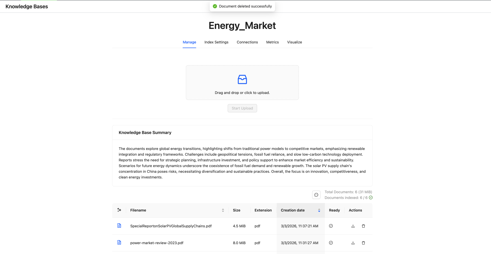

### Step 1.2: Query RAG Studio Directly

Test the RAG system by querying it directly with a question.

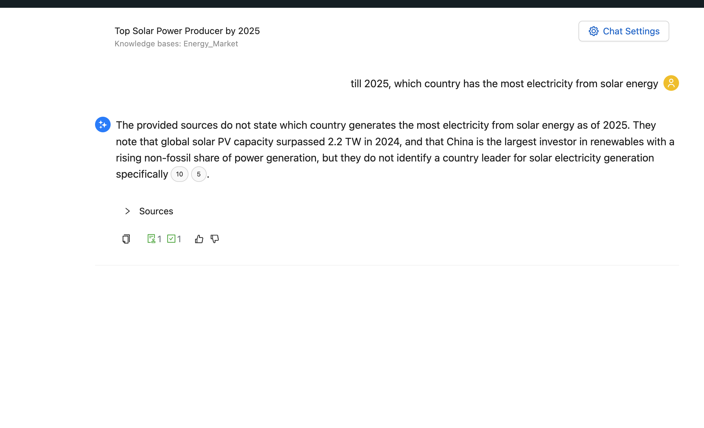

### Step 1.3: Review Retrieved Resources

Examine the retrieved chunks/resources that RAG uses to generate answers.

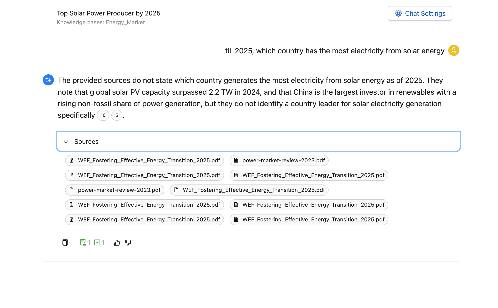

---

## Part 2: Create the RAG Studio Tool

The workflow uses a custom `rag_studio_tool` to interact with RAG Studio. This tool is already included in the workflow template, but understanding its structure helps with troubleshooting.

### Step 2.1: Tool Overview

The `rag_studio_tool` supports these actions:

| Action | Description |
|--------|-------------|
| `query` | Search the knowledge base with a question |
| `upload_document` | Upload a document to a knowledge base |
| `list_knowledge_bases` | List available knowledge bases |
| `get_sessions` | List all sessions |
| `get_chat_history` | Get chat history with evaluations |

### Step 2.2: User Parameters

These parameters are configured per-workflow (you'll fill these in Part 5):

| Parameter | Description | Example |
|-----------|-------------|---------|
| `base_url` | RAG Studio API URL | `https://ragstudio-xxx.cloudera.site` |
| `api_key` | API key for authentication | Bearer token |
| `knowledge_base_name` | Target knowledge base name | `Local Companies` |
| `project_id` | Project ID for session creation | `1` |
| `inference_model` | LLM model for generation | `gpt-4` |
| `response_chunks` | Number of chunks to return | `5` |
| `timeout_seconds` | HTTP timeout | `60` |

### Step 2.3: Tool Parameters (Agent Use)

When agents use the tool, they specify:

| Parameter | Description |
|-----------|-------------|
| `action` | One of: `query`, `upload_document`, `list_knowledge_bases`, `get_sessions`, `get_chat_history` |
| `query` | The question to send (for `query` action) |
| `file_path` | Local file path (for `upload_document` action) |
| `session_id` | Session ID (for `get_chat_history` action) |

### Step 2.4: Tool Code Reference

The tool is built with Python using `requests` and `pydantic`. Key functions:

```python
# requirements.txt
requests>=2.31.0
pydantic>=2.0.0
```

The tool handles:
- Session creation and cleanup for queries
- Streaming response parsing from RAG Studio
- Document upload via multipart form
- Knowledge base discovery by name

---

## Part 3: Import the Workflow Template

### Step 3.1: Import Template

1. In Agent Studio, go to **Agentic Workflows** > **Import Template**
2. Enter path: `/home/cdsw/rag_evaluation_workflow.zip`
3. Click **Import**

### Step 3.2: Create Workflow from Template

Click the imported template to create a new workflow. The template includes 5 agents and 5 tasks.

---

## Part 4: Modify Workflow for Text Input

The imported template uses file upload (`{Attachments}`). Due to browser restrictions, we'll modify it to accept copy-pasted text input (`{document_text}`) instead.

### Why Text Input?

- File upload may be blocked in some environments
- Easier to test with text snippets
- Works with any text content, not just PDFs

### Step 4.1: Update Agent 1 - Q&A Pair Generator

1. Click edit on the **Q&A Pair Generator** agent
2. **Delete** the attached PDF tool (not needed for text input)
3. Update the agent properties using the table below:

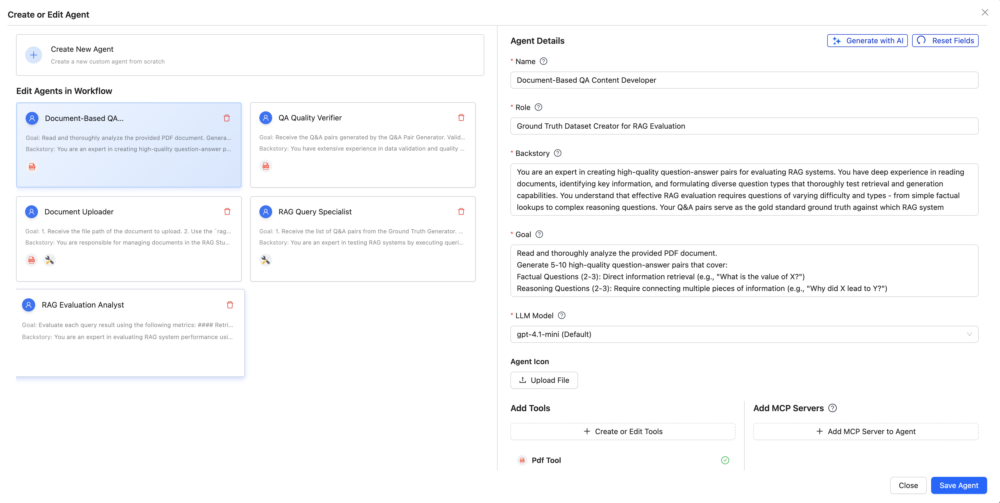

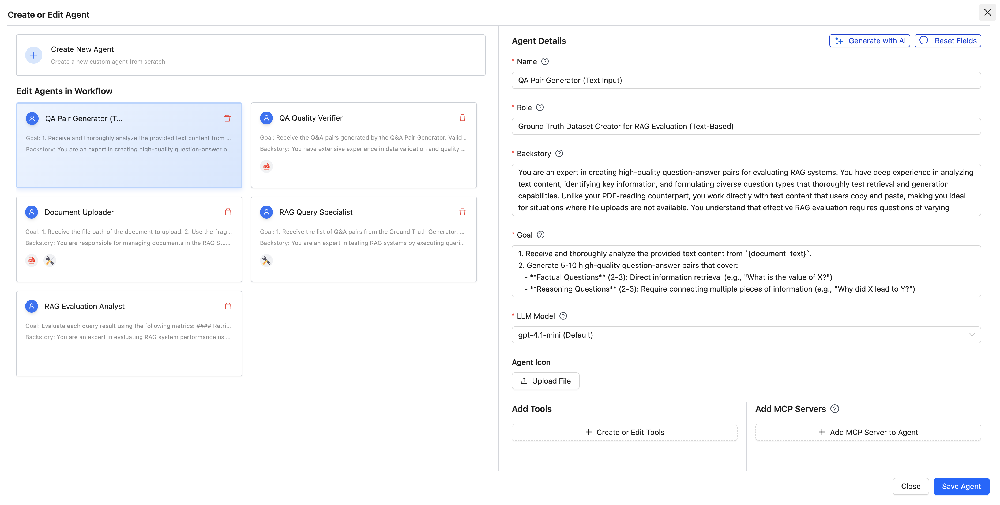

#### Agent 1 (Text Input) - Copy/Paste Values

| Field | Value |
|-------|-------|
| **Name** | `QA Pair Generator (Text Input)` |
| **Role** | `Ground Truth Dataset Creator for RAG Evaluation (Text-Based)` |
| **Backstory** | `You are an expert in creating high-quality question-answer pairs for evaluating RAG systems. You have deep experience in analyzing text content, identifying key information, and formulating diverse question types that thoroughly test retrieval and generation capabilities. Unlike your PDF-reading counterpart, you work directly with text content that users copy and paste, making you ideal for situations where file uploads are not available. You understand that effective RAG evaluation requires questions of varying difficulty and types - from simple factual lookups to complex reasoning questions. Your Q&A pairs serve as the gold standard ground truth against which RAG system outputs will be measured.` |
| **Goal** | `1. Receive and thoroughly analyze the provided text content from {document_text}. 2. Generate 5-10 high-quality question-answer pairs covering: Factual Questions (2-3), Reasoning Questions (2-3), Summarization Questions (1-2), Comparison Questions (1-2). 3. For each Q&A pair, provide: question, answer, type (factual/reasoning/summarization/comparison), source_reference. 4. Output the Q&A pairs in JSON format for downstream processing.` |

#### Agent 1 Expected Output Format

```json
{
  "document_name": "User Provided Text",
  "qa_pairs": [
    {
      "id": 1,
      "question": "What is the question text?",
      "answer": "The ground truth answer",
      "type": "factual",
      "source_reference": "Paragraph 3, starting with '...'"
    }
  ]
}
```

---

### Step 4.2: Update Agent 2 - Q&A Quality Verifier

1. Click edit on the **Q&A Quality Verifier** agent
2. Update to validate against `{document_text}` instead of PDF

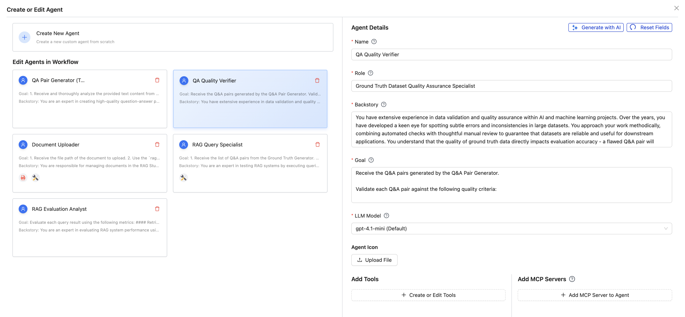

#### Agent 2 (Text Input) - Copy/Paste Values

| Field | Value |
|-------|-------|
| **Name** | `QA Quality Verifier (Text Input)` |
| **Role** | `Ground Truth Dataset Quality Assurance Specialist (Text-Based)` |
| **Backstory** | `You have extensive experience in data validation and quality assurance within AI and machine learning projects. Over the years, you have developed a keen eye for spotting subtle errors and inconsistencies in large datasets. You approach your work methodically, combining automated checks with thoughtful manual review to guarantee that datasets are reliable and useful for downstream applications. Unlike your PDF-reading counterpart, you work directly with text content that users copy and paste, allowing you to validate Q&A pairs even when file uploads are not available. You understand that the quality of ground truth data directly impacts evaluation accuracy - a flawed Q&A pair will produce misleading evaluation results. Your rigorous validation ensures that only high-quality, unambiguous Q&A pairs proceed to the evaluation pipeline.` |
| **Goal** | `1. Receive the Q&A pairs generated by the Q&A Pair Generator. 2. Reference the original text content from {document_text} for validation. 3. Validate each Q&A pair for: Answer accuracy, completeness, conciseness; Question clarity and answerability; Question type coverage and diversity; No duplicates, accurate source references. 4. Assign quality score (0-1) to each pair, flag issues. 5. Output validation report with approved pairs (score >= 0.8), flagged pairs with issues, and recommendations.` |

#### Agent 2 Expected Output Format

```json
{
  "validation_summary": {
    "total_pairs": 10,
    "approved": 8,
    "flagged": 2,
    "overall_quality_score": 0.85,
    "question_type_coverage": {
      "factual": 3,
      "reasoning": 3,
      "summarization": 2,
      "comparison": 2
    }
  },
  "validated_pairs": [
    {
      "id": 1,
      "question": "...",
      "answer": "...",
      "type": "factual",
      "source_reference": "Paragraph 3",
      "quality_score": 0.95,
      "status": "approved",
      "issues": []
    },
    {
      "id": 2,
      "question": "...",
      "answer": "...",
      "type": "reasoning",
      "source_reference": "Paragraph 5",
      "quality_score": 0.65,
      "status": "flagged",
      "issues": ["Answer is incomplete", "Missing key context"]
    }
  ],
  "recommendations": ["Consider revising flagged Q&A pairs before proceeding"]
}
```

---

### Step 4.3: Update Agent 3 - Document Generator & Uploader

1. Click edit on **Agent 3**
2. This agent now generates PDF from text AND uploads it
3. Ensure both `write_to_shared_pdf` and `rag_studio_tool` are attached

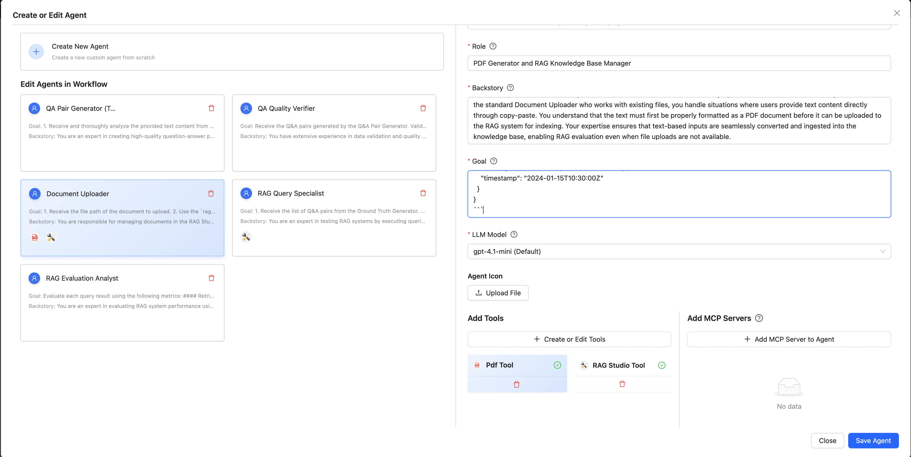

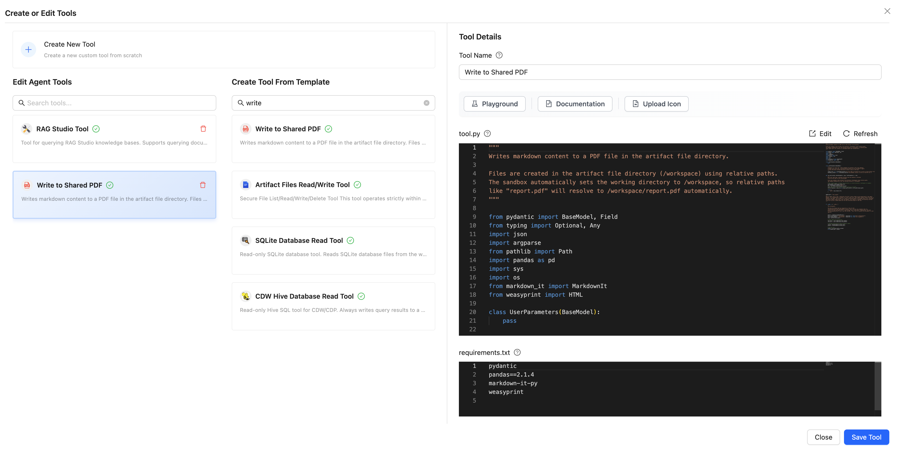

#### Agent 3 (Text Input) - Copy/Paste Values

| Field | Value |
|-------|-------|
| **Name** | `Document Generator and Uploader (Text Input)` |
| **Role** | `PDF Generator and RAG Knowledge Base Manager` |
| **Backstory** | `You are responsible for converting text content into PDF documents and managing them in the RAG Studio knowledge base. Unlike the standard Document Uploader who works with existing files, you handle situations where users provide text content directly through copy-paste. You understand that the text must first be properly formatted as a PDF document before it can be uploaded to the RAG system for indexing. Your expertise ensures that text-based inputs are seamlessly converted and ingested into the knowledge base, enabling RAG evaluation even when file uploads are not available.` |
| **Goal** | `1. Receive the text content from {document_text}. 2. Use write_to_shared_pdf tool with output_file="source_document.pdf" and markdown_content set to the text content. 3. After PDF generation, use rag_studio_tool with action="upload_document" to upload the generated PDF to the configured knowledge base. 4. Verify both operations were successful. 5. Report combined status: PDF generation success/failure, upload status, knowledge base name and ID, document name.` |
| **Tools** | `write_to_shared_pdf`, `rag_studio_tool` |

#### Agent 3 Expected Output Format

```json
{
  "pdf_generation": {
    "status": "success",
    "file_path": "/home/cdsw/source_document.pdf",
    "file_name": "source_document.pdf"
  },
  "upload_status": {
    "status": "success",
    "knowledge_base_name": "My Knowledge Base",
    "knowledge_base_id": "kb-123",
    "document_name": "source_document.pdf",
    "message": "Document uploaded successfully",
    "timestamp": "2026-03-03T10:30:00Z"
  }
}
```

---

### Step 4.4: Update Tasks

Update the task descriptions to match the text input workflow:

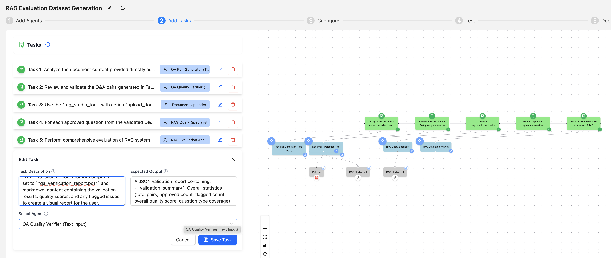

#### Task 1 (Text Input) - Copy/Paste Values

| Field | Value |
|-------|-------|
| **Description** | `Analyze the document content provided directly as text input {document_text} (copy-pasted by the user). Generate a comprehensive set of question-answer pairs that will serve as the ground truth dataset for RAG evaluation. The generated Q&A pairs must be diverse, covering different question types and difficulty levels to thoroughly test the RAG system's retrieval and generation capabilities. Finally, use the write_to_shared_pdf tool with output_file set to "qa_pairs_report.pdf" and markdown_content containing the formatted Q&A pairs to create a visual report for the user.` |
| **Expected Output** | `A JSON object containing 5-10 Q&A pairs with: document_name, qa_pairs array (each with id, question, answer, type, source_reference)` |
| **Assigned Agent** | `QA Pair Generator (Text Input)` |

#### Task 2 (Text Input) - Copy/Paste Values

| Field | Value |
|-------|-------|
| **Description** | `Review and validate the Q&A pairs generated in the previous task against the original text content provided as {document_text}. Verify that each answer is factually accurate and grounded in the source text. Assess each pair for accuracy, clarity, completeness, and appropriate difficulty classification. Filter out low-quality pairs and provide quality scores for approved pairs. Finally, use the write_to_shared_pdf tool with output_file set to "qa_verification_report.pdf" and markdown_content containing the validation results, quality scores, and any flagged issues to create a visual report for the user.` |
| **Expected Output** | `A JSON validation report with: validation_summary (total, approved, flagged, overall score, type coverage), validated_pairs (each with quality_score, status, issues), recommendations` |
| **Assigned Agent** | `QA Quality Verifier (Text Input)` |

#### Task 3 (Text Input) - Copy/Paste Values

| Field | Value |
|-------|-------|
| **Description** | `First, use the write_to_shared_pdf tool with output_file set to "source_document.pdf" and markdown_content set to the text content from {document_text} to generate a PDF document from the user's pasted text. Then, use the rag_studio_tool with action "upload_document" and file_path parameter set to the generated PDF path to upload the document to the configured RAG Studio knowledge base. Ensure the document is successfully ingested and ready for retrieval queries.` |
| **Expected Output** | `A JSON status report with: pdf_generation (status, file_path, file_name), upload_status (status, knowledge_base_name, knowledge_base_id, document_name, message, timestamp)` |
| **Assigned Agent** | `Document Generator and Uploader (Text Input)` |

#### Task 4 - Copy/Paste Values (No changes needed)

| Field | Value |
|-------|-------|
| **Description** | `For each approved question from the validated Q&A pairs, use the rag_studio_tool with action "query" and the query parameter set to the question text. Execute all queries against the RAG Studio knowledge base and collect both the RAG-generated answers and the retrieved source chunks for each query.` |
| **Expected Output** | `A JSON object with query_results array (each with id, question, ground_truth_answer, rag_answer, retrieved_chunks, question_type)` |
| **Assigned Agent** | `RAG Query Specialist` |

#### Agent 4 (RAG Query Specialist) Expected Output Format

```json
{
  "query_results": [
    {
      "id": 1,
      "question": "What is the question?",
      "ground_truth_answer": "Expected answer from Q&A pairs",
      "rag_answer": "Answer generated by RAG system",
      "retrieved_chunks": ["chunk 1 text...", "chunk 2 text..."],
      "question_type": "factual"
    }
  ]
}
```

#### Task 5 - Copy/Paste Values (No changes needed)

| Field | Value |
|-------|-------|
| **Description** | `Perform comprehensive evaluation of RAG system performance by comparing RAG outputs against ground truth answers. Apply multiple evaluation metrics covering both retrieval quality (context relevance) and generation quality (faithfulness, answer relevance, semantic similarity, correctness). Generate a detailed evaluation report with per-question scores and overall summary statistics. Finally, use the write_to_shared_pdf tool with output_file set to "rag_evaluation_report.pdf" to create a comprehensive visual report.` |
| **Expected Output** | `A JSON evaluation report with: evaluation_summary (total_questions, avg metrics), detailed_results (per-question scores and reasoning), recommendations` |
| **Assigned Agent** | `RAG Evaluation Analyst` |

#### Agent 5 (RAG Evaluation Analyst) Expected Output Format

```json
{
  "evaluation_summary": {
    "total_questions": 10,
    "avg_context_relevance": 0.85,
    "avg_faithfulness": 0.90,
    "avg_answer_relevance": 0.88,
    "avg_semantic_similarity": 0.82,
    "avg_correctness": 0.80
  },
  "detailed_results": [
    {
      "id": 1,
      "question": "What is the question?",
      "question_type": "factual",
      "scores": {
        "context_relevance": 0.9,
        "faithfulness": 1.0,
        "answer_relevance": 0.85,
        "semantic_similarity": 0.8,
        "correctness": 0.9
      },
      "reasoning": "The retrieved chunks contained relevant information..."
    }
  ],
  "recommendations": [
    "Consider improving chunking strategy for better retrieval",
    "The RAG system performs well on factual questions"
  ]
}
```

---

## Part 5: Configure RAG Studio Tool Parameters

### Step 5.1: Fill Tool Parameters

1. Click **Configure** in the workflow editor
2. Under **Tools and MCPs**, find `rag_studio_tool`
3. Enter your RAG Studio connection details:

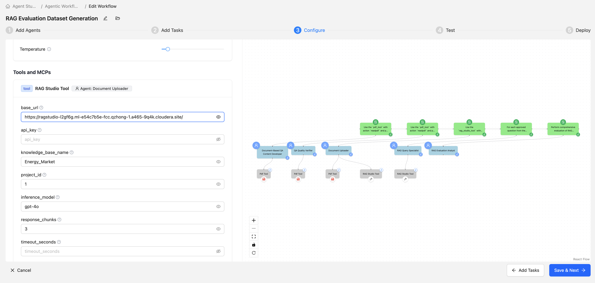

| Parameter | Description |
|-----------|-------------|
| **base_url** | Your RAG Studio URL (e.g., `https://ragstudio-xxx.cloudera.site`) |
| **api_key** | Your API key/Bearer token |
| **knowledge_base_name** | Name of your knowledge base |
| **project_id** | Project ID (usually `1`) |
| **inference_model** | LLM model name |
| **response_chunks** | Number of chunks (default: `5`) |
| **timeout_seconds** | Timeout (default: `60`) |

---

## Part 6: Test the Workflow

### Step 6.1: Prepare Test Input

Use the sample document below or your own content. Copy and paste into `{document_text}`:

<details>
<summary>Click to expand sample document</summary>

```
Summary of "Artificial Intelligence in the Power Sector"

Authors: Baloko Makala and Tonci Bakovic, International Finance Corporation (IFC)

Overview and Context

The document explores how artificial intelligence (AI) is transforming the global energy sector, with a specific focus on emerging markets.

Emerging markets face acute energy challenges, including:
- Rising demand
- Lack of universal access
- Prevalent efficiency issues such as informal grid connections (power theft) that lead to unbilled power and increased carbon emissions

Currently, around 860 million people globally lack access to electricity, which acts as a fundamental impediment to development, health, and poverty reduction.

Key Applications of AI in the Power Sector

1. Smart Grids and Data Analytics

AI, particularly machine learning, is essential for analyzing the massive amounts of data generated by smart meters, sensors, and Phasor Measurement Units (PMUs) to improve grid reliability and efficiency.

2. Renewable Energy Integration

AI addresses the intermittent nature of renewable sources like solar and wind by predicting weather patterns and energy output, which helps grid operators balance loads and manage energy storage effectively. DeepMind, for instance, uses neural networks trained on weather forecasts to predict wind power output 36 hours in advance.

3. Theft Prevention

In Brazil, the utility company Ampla utilizes AI to identify unusual consumption patterns, anticipate consumer behavior, and effectively target and curb power theft in complex urban areas.

4. Predictive Maintenance and Fault Detection

AI combined with sensors and drones allows companies to monitor equipment continuously, detect faults, and perform preventive maintenance before catastrophic failures occur.

5. Expanding Access in Low-Income Countries

AI-supported business models, such as the pay-as-you-go smart-solar solutions by Azuri Technologies, learn a household's energy needs and adjust power output (like dimming lights or slowing fans) to optimize off-grid power usage in rural Africa.

Challenges and Future Outlook

Knowledge Gap: AI companies often possess strong computer science skills but lack the specialized knowledge required to understand complex power systems, a problem that is particularly acute in emerging markets.

Connectivity Issues: The success of AI and smart meters relies on continuous data transmission, which is severely limited in rural or low-income areas lacking reliable cellular network coverage.

Cybersecurity Risks: The digital transformation of power grids has made them vulnerable to hackers, transforming cyberattacks into threats that can be as damaging as natural disasters.

Model Limitations: AI models often act as "black boxes" whose inner workings are poorly understood by users, posing a security risk. They are also susceptible to inaccurate data and require safeguards when deployed in critical energy systems.
```

</details>

### Step 6.2: Run the Workflow

1. Click **Test** in the workflow editor
2. Paste your document text into `{document_text}`
3. Click **Run**

### Step 6.3: Monitor Progress

Watch the workflow execute through each stage:

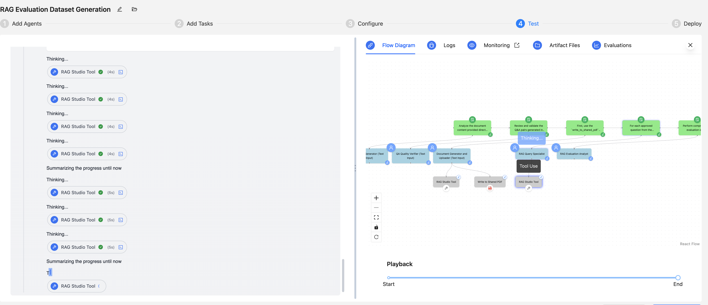

### Step 6.4: Review Results

The final evaluation report includes metrics for each Q&A pair:

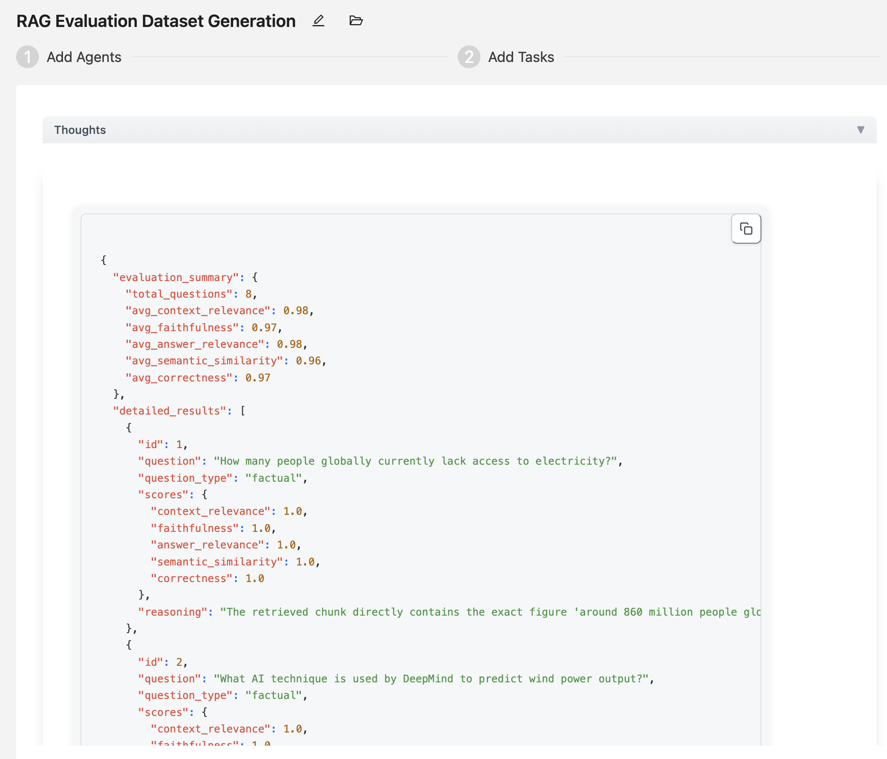

---

## Part 7: Understanding Evaluation Metrics

### Retrieval Metric

| Metric | Description | Scale |
|--------|-------------|-------|
| **Context Relevance** | Are retrieved chunks relevant to answering the question? | 0-1 |

- Score 1.0: Retrieved chunks contain all necessary information
- Score 0.5: Retrieved chunks contain partial information
- Score 0.0: Retrieved chunks are irrelevant

### Generation Metrics

| Metric | Description | Scale |
|--------|-------------|-------|
| **Faithfulness** | Is the answer grounded in retrieved context? | 0-1 |
| **Answer Relevance** | Does the answer address the question? | 0-1 |
| **Semantic Similarity** | How similar is RAG answer to ground truth? | 0-1 |
| **Correctness** | Is the answer factually correct? | 0-1 |

### Interpreting Results

| Pattern | Diagnosis |
|---------|-----------|
| High Context Relevance + Low Correctness | Generation issue - retrieval works but LLM struggles |
| Low Context Relevance + Low Correctness | Retrieval issue - wrong chunks being retrieved |
| High all metrics | Good RAG performance |
| Low Faithfulness + High Correctness | Answer is correct but includes info not in context (potential hallucination) |

---

## Troubleshooting

| Issue | Solution |
|-------|----------|
| RAG tool connection fails | Verify base_url, api_key, and knowledge_base_name |
| PDF generation fails | Check `write_to_shared_pdf` tool is properly attached to Agent 3 |
| No Q&A pairs generated | Ensure document text is substantial enough (500+ words recommended) |
| Low evaluation scores | Review knowledge base content and chunking strategy |
| "Knowledge base not found" | Run `list_knowledge_bases` action to see available names |

---

## Next Steps

- Test with different document types and domains
- Compare evaluation results across different RAG configurations
- Adjust chunking strategies based on evaluation insights
- Experiment with different inference models
