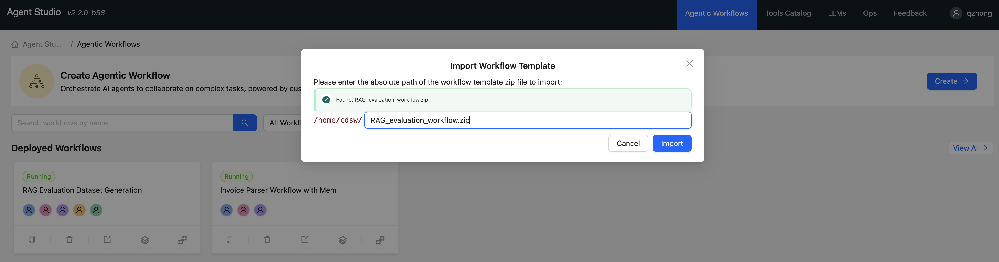
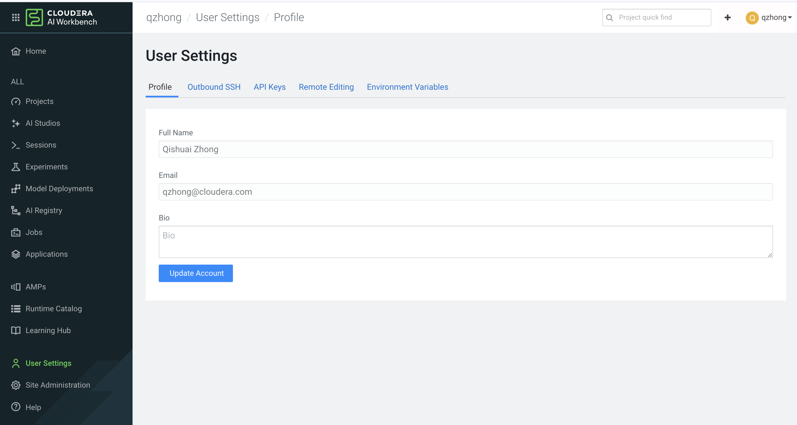
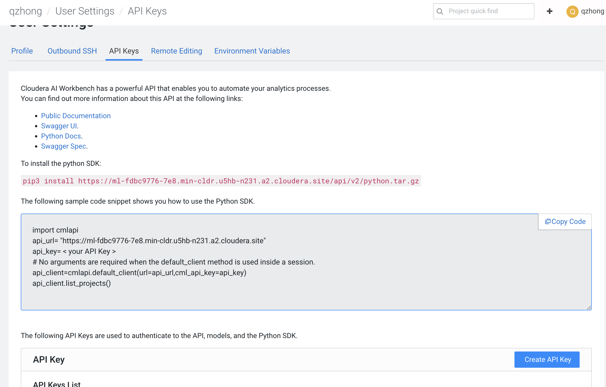
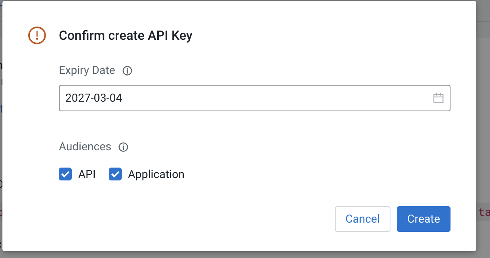
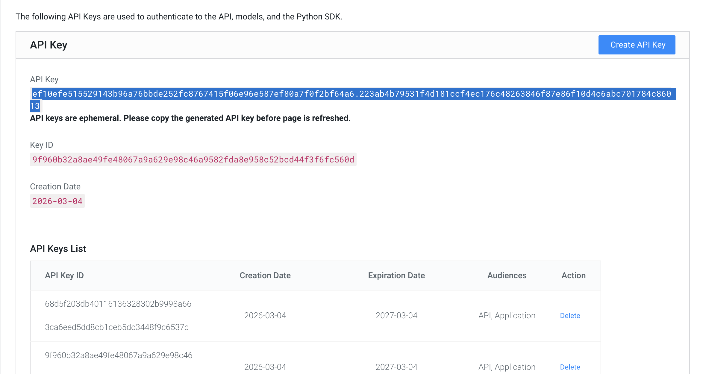

# Lab: RAG Evaluation Workflow

## Overview

Build an agent workflow to evaluate a RAG (Retrieval-Augmented Generation) application. The workflow performs 5 sequential tasks:

1. **Generate Ground Truth** - Generate Q&A pairs from document content
2. **Verify Quality** - Validate and score the Q&A pairs
3. **Upload Document** - Upload to RAG Studio knowledge base
4. **Query RAG** - Query RAG with validated questions, collect responses
5. **Evaluate Results** - Compare RAG outputs against ground truth

### Architecture

```
┌──────────────────────────────────────────────────────────────────────────────┐
│                     RAG EVALUATION SEQUENTIAL WORKFLOW                        │
├──────────────────────────────────────────────────────────────────────────────┤
│                                                                              │
│  ┌──────────┐    ┌──────────┐    ┌──────────┐    ┌──────────┐    ┌────────┐│
│  │  TASK 1  │    │  TASK 2  │    │  TASK 3  │    │  TASK 4  │    │ TASK 5 ││
│  │ Generate │───▶│  Verify  │───▶│  Upload  │───▶│  Query   │───▶│Evaluate││
│  │Ground Trh│    │  Quality │    │ Document │    │   RAG    │    │Results ││
│  └────┬─────┘    └────┬─────┘    └────┬─────┘    └────┬─────┘    └───┬────┘│
│       │               │               │               │              │      │
│       ▼               ▼               ▼               ▼              ▼      │
│  ┌──────────┐    ┌──────────┐    ┌──────────┐    ┌──────────┐    ┌────────┐│
│  │ AGENT 1  │    │ AGENT 2  │    │ AGENT 3  │    │ AGENT 4  │    │AGENT 5 ││
│  │  Q&A Pair│    │  Quality │    │ Document │    │RAG Query │    │Evaluat-││
│  │ Generator│    │ Verifier │    │ Uploader │    │Specialist│    │ion     ││
│  └──────────┘    └──────────┘    └──────────┘    └──────────┘    └────────┘│
│                                                                              │
└──────────────────────────────────────────────────────────────────────────────┘
```

---

## Prerequisites

- Access to Cloudera AI Agent Studio
- RAG Studio with a knowledge base already created

---

## Part 1: Explore RAG Studio

Before building the evaluation workflow, explore RAG Studio directly.

### Step 1.1: View Knowledge Base

In RAG Studio, view your existing knowledge base with uploaded documents.


### Step 1.2: Query RAG Studio Directly

Test the RAG system by querying it directly with a question.


### Step 1.3: Review Retrieved Resources

Examine the retrieved chunks/resources that RAG uses to generate answers.


---

## Part 2: Create the RAG Studio Tool

The workflow uses a custom `rag_studio_tool` to interact with RAG Studio. This tool is already included in the workflow template, but understanding its structure helps with troubleshooting.

### Step 2.1: Tool Overview

The `rag_studio_tool` supports these actions:

| Action | Description |
|--------|-------------|
| `query` | Search the knowledge base with a question |
| `upload_document` | Upload a document to a knowledge base |
| `list_knowledge_bases` | List available knowledge bases |
| `get_sessions` | List all sessions |
| `get_chat_history` | Get chat history with evaluations |


Tool.py

```python
"""
Tool for querying RAG Studio knowledge bases.
Supports querying documents from specific knowledge bases (data sources).
"""

import json
import argparse
import requests
from typing import Literal, Optional, Dict, List
from pydantic import BaseModel, Field


class UserParameters(BaseModel):
    """
    Args:
        base_url (str): The base URL of the RAG Studio (e.g., 'https://ragstudio-xxx.cloudera.site').
        api_key (str): API key for authentication.
        knowledge_base_name (str): Name of the default knowledge base (data source) to query.
        project_id (int): The project ID for session creation.
        inference_model (Optional[str]): The inference model to use for generating responses.
        response_chunks (int): Number of chunks to return in responses.
        timeout_seconds (int): HTTP timeout in seconds.
    """
    base_url: str = Field(description="The base URL of the RAG Studio API")
    api_key: str = Field(description="API key for RAG Studio authentication")
    knowledge_base_name: str = Field(description="Name of the knowledge base (data source) to query (e.g., 'Local Companies')")
    project_id: int = Field(default=1, description="The project ID for session creation")
    inference_model: Optional[str] = Field(default=None, description="The inference model to use (e.g., 'gpt-4')")
    response_chunks: int = Field(default=5, description="Number of chunks to return in responses (default: 5)")
    timeout_seconds: int = Field(default=60, description="HTTP timeout in seconds")


class ToolParameters(BaseModel):
    action: Literal["query", "list_knowledge_bases", "get_chat_history", "get_sessions", "upload_document"] = Field(
        description="Action to perform: 'query' (search the knowledge base), 'list_knowledge_bases' (list all knowledge bases), 'get_chat_history' (get chat history with evaluations for a session), 'get_sessions' (list all sessions), 'upload_document' (upload a document to a knowledge base)"
    )

    # Query parameters
    query: Optional[str] = Field(
        default=None,
        description="The question or search query to send to the RAG system (required for 'query' action)"
    )

    # Session ID for chat history
    session_id: Optional[int] = Field(
        default=None,
        description="Session ID for 'get_chat_history' action"
    )

    # Document upload parameters
    file_path: Optional[str] = Field(
        default=None,
        description="Local file path of the document to upload (required for 'upload_document' action)"
    )


def _build_headers(api_key: str) -> Dict[str, str]:
    """Build request headers with authentication."""
    return {
        'Content-Type': 'application/json',
        'accept': 'application/json',
        'Authorization': f'Bearer {api_key}'
    }


def _make_request(method: str, url: str, headers: Dict[str, str],
                  json_data: Optional[Dict] = None, timeout: int = 60) -> requests.Response:
    """Make HTTP request with redirect following."""
    if method == "GET":
        return requests.get(url, headers=headers, timeout=timeout, allow_redirects=True)
    elif method == "POST":
        return requests.post(url, headers=headers, json=json_data, timeout=timeout, allow_redirects=True)
    elif method == "DELETE":
        return requests.delete(url, headers=headers, timeout=timeout, allow_redirects=True)
    else:
        raise ValueError(f"Unsupported HTTP method: {method}")


def get_data_sources(base_url: str, headers: Dict[str, str], timeout: int) -> List[Dict]:
    """Get all available data sources (knowledge bases)."""
    endpoint = f"{base_url}/api/v1/rag/dataSources"
    response = _make_request("GET", endpoint, headers, timeout=timeout)
    response.raise_for_status()
    return response.json()


def find_data_source_by_name(data_sources: List[Dict], name: str) -> Optional[Dict]:
    """Find a data source by name (case-insensitive partial match)."""
    name_lower = name.lower()
    # First try exact match
    for ds in data_sources:
        if ds.get('name', '').lower() == name_lower:
            return ds
    # Then try partial match
    for ds in data_sources:
        if name_lower in ds.get('name', '').lower():
            return ds
    return None


def create_session(base_url: str, headers: Dict[str, str],
                   data_source_ids: List[int], project_id: int,
                   inference_model: Optional[str], response_chunks: int,
                   timeout: int) -> Dict:
    """Create a new RAG session."""
    endpoint = f"{base_url}/api/v1/rag/sessions"
    payload = {
        "name": "Query Session",
        "dataSourceIds": data_source_ids,
        "projectId": project_id,
        "responseChunks": response_chunks,
        "queryConfiguration": {
            "disableStreaming": False
        }
    }
    if inference_model:
        payload["inferenceModel"] = inference_model

    response = _make_request("POST", endpoint, headers, json_data=payload, timeout=timeout)
    response.raise_for_status()
    return response.json()


def get_sessions(base_url: str, headers: Dict[str, str], timeout: int) -> List[Dict]:
    """Get all available sessions."""
    endpoint = f"{base_url}/api/v1/rag/sessions"
    response = _make_request("GET", endpoint, headers, timeout=timeout)
    response.raise_for_status()
    return response.json()


def get_chat_history(base_url: str, headers: Dict[str, str],
                     session_id: int, timeout: int) -> Dict:
    """Get chat history for a session, including evaluations."""
    endpoint = f"{base_url}/llm-service/sessions/{session_id}/chat-history"
    response = _make_request("GET", endpoint, headers, timeout=timeout)
    response.raise_for_status()
    return response.json()


def upload_document(base_url: str, api_key: str, data_source_id: int,
                    file_path: str, timeout: int) -> Dict:
    """Upload a document to a knowledge base (data source)."""
    import os

    endpoint = f"{base_url}/api/v1/rag/dataSources/{data_source_id}/files"

    # Prepare headers for multipart upload (no Content-Type, let requests set it)
    headers = {
        'accept': 'application/json',
        'Authorization': f'Bearer {api_key}'
    }

    # Prepare the file for upload
    filename = os.path.basename(file_path)
    with open(file_path, 'rb') as f:
        files = {'file': (filename, f)}
        response = requests.post(
            endpoint, headers=headers, files=files,
            timeout=timeout, allow_redirects=True
        )

    response.raise_for_status()
    return response.json()


def delete_session(base_url: str, headers: Dict[str, str], session_id: int, timeout: int):
    """Delete a RAG session."""
    endpoint = f"{base_url}/api/v1/rag/sessions/{session_id}"
    try:
        _make_request("DELETE", endpoint, headers, timeout=timeout)
    except:
        pass  # Ignore deletion errors


def send_chat_message(base_url: str, headers: Dict[str, str], session_id: int,
                      message: str, timeout: int) -> Dict:
    """Send a chat message to a RAG session and get the response via streaming endpoint."""
    endpoint = f"{base_url}/llm-service/sessions/{session_id}/stream-completion"
    payload = {
        "query": message
    }

    # Use streaming response
    response = requests.post(
        endpoint, headers=headers, json=payload,
        timeout=timeout, allow_redirects=True, stream=True
    )
    response.raise_for_status()

    # Collect streamed response chunks
    full_response = []
    sources = []
    response_id = None

    for line in response.iter_lines(decode_unicode=True):
        if not line:
            continue

        # Handle SSE format (data: {...})
        if line.startswith("data:"):
            line = line[5:].strip()

        if not line or line == "[DONE]":
            continue

        try:
            chunk = json.loads(line)
            if isinstance(chunk, dict):
                # Skip event messages (thinking, agent_done, chat_done)
                if 'event' in chunk:
                    continue

                # Extract response_id
                if 'response_id' in chunk:
                    response_id = chunk['response_id']
                    continue

                # Format: {"text": "..."} - RAG Studio format
                if 'text' in chunk:
                    full_response.append(chunk['text'])
                # Format: {"content": "..."}
                elif 'content' in chunk:
                    full_response.append(chunk['content'])
                # Format: {"delta": {"content": "..."}}
                elif 'delta' in chunk and isinstance(chunk['delta'], dict):
                    if 'content' in chunk['delta']:
                        full_response.append(chunk['delta']['content'])
                # Format: {"choices": [{"delta": {"content": "..."}}]}
                elif 'choices' in chunk and chunk['choices']:
                    choice = chunk['choices'][0]
                    if 'delta' in choice and 'content' in choice['delta']:
                        full_response.append(choice['delta']['content'])
                    elif 'text' in choice:
                        full_response.append(choice['text'])

                # Extract sources if present
                if 'sources' in chunk:
                    sources.extend(chunk['sources'])
                elif 'references' in chunk:
                    sources.extend(chunk['references'])
                elif 'source_nodes' in chunk:
                    sources.extend(chunk['source_nodes'])
        except json.JSONDecodeError:
            # If not JSON, treat as plain text
            full_response.append(line)

    return {
        "answer": "".join(full_response),
        "sources": sources,
        "response_id": response_id
    }


def run_tool(config: UserParameters, args: ToolParameters) -> str:
    """
    Main tool execution function.
    """
    try:
        base_url = config.base_url.rstrip('/')
        headers = _build_headers(config.api_key)
        timeout = config.timeout_seconds

        # Handle 'list_knowledge_bases' action
        if args.action == "list_knowledge_bases":
            return handle_list_knowledge_bases(base_url, headers, timeout)

        # Handle 'query' action
        elif args.action == "query":
            return handle_query(base_url, headers, timeout, config, args)

        # Handle 'get_sessions' action
        elif args.action == "get_sessions":
            return handle_get_sessions(base_url, headers, timeout)

        # Handle 'get_chat_history' action
        elif args.action == "get_chat_history":
            return handle_get_chat_history(base_url, headers, timeout, args)

        # Handle 'upload_document' action
        elif args.action == "upload_document":
            return handle_upload_document(base_url, headers, timeout, config, args)

        else:
            return f"Error: Unsupported action '{args.action}'."

    except requests.exceptions.RequestException as e:
        return f"RAG Studio request failed: {str(e)}"
    except Exception as e:
        return f"Tool execution failed: {str(e)}"


def handle_list_knowledge_bases(base_url: str, headers: Dict[str, str], timeout: int) -> str:
    """List all available knowledge bases (data sources)."""
    data_sources = get_data_sources(base_url, headers, timeout)

    if not data_sources:
        return "No knowledge bases found in RAG Studio."

    formatted = ["Available Knowledge Bases:\n"]
    for ds in data_sources:
        formatted.append(
            f"- Name: {ds.get('name', 'N/A')}\n"
            f"  ID: {ds.get('id', 'N/A')}\n"
            f"  Documents: {ds.get('documentCount', 0)}\n"
            f"  Embedding Model: {ds.get('embeddingModel', 'N/A')}\n"
        )

    return "\n".join(formatted)


def handle_query(base_url: str, headers: Dict[str, str],
                 timeout: int, config: UserParameters, args: ToolParameters) -> str:
    """Handle RAG query operation."""
    if not args.query:
        return "Error: 'query' parameter is required for 'query' action."

    # Get all data sources
    data_sources = get_data_sources(base_url, headers, timeout)

    # Find the target data source using the configured knowledge_base_name
    data_source = find_data_source_by_name(data_sources, config.knowledge_base_name)

    if not data_source:
        available = ", ".join([f"'{ds.get('name', 'Unknown')}'" for ds in data_sources])
        return f"Error: Knowledge base '{config.knowledge_base_name}' not found. Available knowledge bases: {available}"

    data_source_id = data_source.get('id')
    data_source_name = data_source.get('name')

    # Create a session for querying
    session_id = None
    try:
        session = create_session(
            base_url, headers,
            data_source_ids=[data_source_id],
            project_id=config.project_id,
            inference_model=config.inference_model,
            response_chunks=config.response_chunks,
            timeout=timeout
        )
        session_id = session.get('id')
    except requests.exceptions.RequestException as e:
        return f"Error creating query session: {str(e)}"

    # Send the query to the session
    try:
        chat_response = send_chat_message(
            base_url, headers, session_id, args.query, timeout
        )

        # Extract the response
        answer = chat_response.get("answer", "")
        sources = chat_response.get("sources", [])

        if not answer:
            answer = "(No response received)"

        # Format the result
        result_parts = [f"Knowledge Base: {data_source_name}", f"Answer: {answer}"]

        if sources:
            result_parts.append("\nSources:")
            for source in sources:
                if isinstance(source, str):
                    result_parts.append(f"  - {source}")
                elif isinstance(source, dict):
                    name = source.get('name') or source.get('title') or source.get('filename', 'Unknown')
                    result_parts.append(f"  - {name}")

        return "\n".join(result_parts)

    except requests.exceptions.RequestException as e:
        return f"Error querying RAG system: {str(e)}"
    finally:
        # Clean up session
        if session_id:
            delete_session(base_url, headers, session_id, timeout)


def handle_get_sessions(base_url: str, headers: Dict[str, str], timeout: int) -> str:
    """List all available sessions."""
    sessions = get_sessions(base_url, headers, timeout)

    if not sessions:
        return "No sessions found in RAG Studio."

    formatted = ["Available Sessions:\n"]
    for session in sessions:
        formatted.append(
            f"- ID: {session.get('id', 'N/A')}\n"
            f"  Name: {session.get('name', 'N/A')}\n"
            f"  Data Sources: {session.get('dataSourceIds', [])}\n"
            f"  Inference Model: {session.get('inferenceModel', 'N/A')}\n"
        )

    return "\n".join(formatted)


def handle_get_chat_history(base_url: str, headers: Dict[str, str],
                            timeout: int, args: ToolParameters) -> str:
    """Get chat history with evaluations for a session."""
    if not args.session_id:
        return "Error: 'session_id' parameter is required for 'get_chat_history' action."

    history = get_chat_history(base_url, headers, args.session_id, timeout)

    if not history or not history.get('data'):
        return f"No chat history found for session {args.session_id}."

    formatted = [f"Chat History for Session {args.session_id}:\n"]

    for entry in history.get('data', []):
        rag_message = entry.get('rag_message', {})
        evaluations = entry.get('evaluations', [])
        source_nodes = entry.get('source_nodes', [])

        formatted.append(f"--- Message ID: {entry.get('id', 'N/A')} ---")
        formatted.append(f"User: {rag_message.get('user', 'N/A')}")
        formatted.append(f"Assistant: {rag_message.get('assistant', 'N/A')[:500]}...")

        if evaluations:
            formatted.append("Evaluations:")
            for eval_item in evaluations:
                name = eval_item.get('name', 'unknown')
                value = eval_item.get('value', 'N/A')
                formatted.append(f"  - {name}: {value}")

        if source_nodes:
            formatted.append(f"Sources: {len(source_nodes)} documents retrieved")

        formatted.append("")

    return "\n".join(formatted)


def handle_upload_document(base_url: str, headers: Dict[str, str],
                           timeout: int, config: UserParameters,
                           args: ToolParameters) -> str:
    """Handle document upload to a knowledge base."""
    import os

    if not args.file_path:
        return "Error: 'file_path' parameter is required for 'upload_document' action."

    if not os.path.exists(args.file_path):
        return f"Error: File not found: {args.file_path}"

    # Get all data sources to find the target knowledge base
    data_sources = get_data_sources(base_url, headers, timeout)

    # Find the target data source using the configured knowledge_base_name
    data_source = find_data_source_by_name(data_sources, config.knowledge_base_name)

    if not data_source:
        available = ", ".join([f"'{ds.get('name', 'Unknown')}'" for ds in data_sources])
        return f"Error: Knowledge base '{config.knowledge_base_name}' not found. Available: {available}"

    data_source_id = data_source.get('id')
    data_source_name = data_source.get('name')

    try:
        result = upload_document(
            base_url, config.api_key, data_source_id,
            args.file_path, timeout
        )

        filename = os.path.basename(args.file_path)
        return (
            f"Document uploaded successfully!\n"
            f"  File: {filename}\n"
            f"  Knowledge Base: {data_source_name} (ID: {data_source_id})\n"
            f"  Response: {result}"
        )

    except requests.exceptions.RequestException as e:
        return f"Error uploading document: {str(e)}"


OUTPUT_KEY = "tool_output"


if __name__ == "__main__":
    parser = argparse.ArgumentParser()
    parser.add_argument("--user-params", required=True, help="JSON string for tool configuration")
    parser.add_argument("--tool-params", required=True, help="JSON string for tool arguments")
    cli_args = parser.parse_args()

    config_dict = json.loads(cli_args.user_params)
    params_dict = json.loads(cli_args.tool_params)

    config = UserParameters(**config_dict)
    params = ToolParameters(**params_dict)

    output = run_tool(config, params)
    print(OUTPUT_KEY, output)


```

### Step 2.2: User Parameters

These parameters are configured per-workflow (you'll fill these in Part 5):

| Parameter | Description | Example |
|-----------|-------------|---------|
| `base_url` | RAG Studio API URL | `https://ragstudio-xxx.cloudera.site` |
| `api_key` | API key for authentication | Bearer token |
| `knowledge_base_name` | Target knowledge base name | `Local Companies` |
| `project_id` | Project ID for session creation | `1` |
| `inference_model` | LLM model for generation | `gpt-4` |
| `response_chunks` | Number of chunks to return | `5` |
| `timeout_seconds` | HTTP timeout | `60` |

### Step 2.3: Tool Parameters (Agent Use)

When agents use the tool, they specify:

| Parameter | Description |
|-----------|-------------|
| `action` | One of: `query`, `upload_document`, `list_knowledge_bases`, `get_sessions`, `get_chat_history` |
| `query` | The question to send (for `query` action) |
| `file_path` | Local file path (for `upload_document` action) |
| `session_id` | Session ID (for `get_chat_history` action) |

### Step 2.4: Tool Code Reference

The tool is built with Python using `requests` and `pydantic`. Key functions:

```python
# requirements.txt
requests>=2.31.0
pydantic>=2.0.0
```

The tool handles:
- Session creation and cleanup for queries
- Streaming response parsing from RAG Studio
- Document upload via multipart form
- Knowledge base discovery by name

---

## Part 3: Import the Workflow Template

### Step 3.1: Import Template

1. In Agent Studio, go to **Agentic Workflows** > **Import Template**
2. Enter path: `/home/cdsw/rag_evaluation_workflow.zip`
3. Click **Import**



### Step 3.2: Create Workflow from Template

Click the imported template to create a new workflow. The template includes 5 agents and 5 tasks.

---

## Part 4: Modify Workflow for Text Input

The imported template uses file upload (`{Attachments}`). Due to browser restrictions, we'll modify it to accept copy-pasted text input (`{document_text}`) instead.

### Why Text Input?

- File upload may be blocked in some environments
- Easier to test with text snippets
- Works with any text content, not just PDFs

### Step 4.1: Update Agent 1 - Q&A Pair Generator

1. Click edit on the **Q&A Pair Generator** agent
2. **Delete** the attached PDF tool (not needed for text input)
3. Update the agent properties using the table below:


#### Agent 1 (Text Input) - Copy/Paste Values

| Field | Value |
|-------|-------|
| **Name** | `QA Pair Generator (Text Input)` |
| **Role** | `Ground Truth Dataset Creator for RAG Evaluation (Text-Based)` |
| **Backstory** | `You are an expert in creating high-quality question-answer pairs for evaluating RAG systems. You have deep experience in analyzing text content, identifying key information, and formulating diverse question types that thoroughly test retrieval and generation capabilities. Unlike your PDF-reading counterpart, you work directly with text content that users copy and paste, making you ideal for situations where file uploads are not available. You understand that effective RAG evaluation requires questions of varying difficulty and types - from simple factual lookups to complex reasoning questions. Your Q&A pairs serve as the gold standard ground truth against which RAG system outputs will be measured.` |
| **Goal** | See below (multi-line) |

**Goal (copy this):**
```
1. Receive and thoroughly analyze the provided text content from {document_text}.
2. Generate 5-10 high-quality question-answer pairs covering: Factual Questions (2-3), Reasoning Questions (2-3), Summarization Questions (1-2), Comparison Questions (1-2).
3. For each Q&A pair, provide: question, answer, type (factual/reasoning/summarization/comparison), source_reference.
4. Output the Q&A pairs in the following JSON format:
{
  "document_name": "User Provided Text",
  "qa_pairs": [
    {
      "id": 1,
      "question": "What is the question text?",
      "answer": "The ground truth answer",
      "type": "factual",
      "source_reference": "Paragraph 3, starting with '...'"
    }
  ]
}
```

---

### Step 4.2: Update Agent 2 - Q&A Quality Verifier

1. Click edit on the **Q&A Quality Verifier** agent
2. Update to validate against `{document_text}` instead of PDF


#### Agent 2 (Text Input) - Copy/Paste Values

| Field | Value |
|-------|-------|
| **Name** | `QA Quality Verifier (Text Input)` |
| **Role** | `Ground Truth Dataset Quality Assurance Specialist (Text-Based)` |
| **Backstory** | `You have extensive experience in data validation and quality assurance within AI and machine learning projects. Over the years, you have developed a keen eye for spotting subtle errors and inconsistencies in large datasets. You approach your work methodically, combining automated checks with thoughtful manual review to guarantee that datasets are reliable and useful for downstream applications. Unlike your PDF-reading counterpart, you work directly with text content that users copy and paste, allowing you to validate Q&A pairs even when file uploads are not available. You understand that the quality of ground truth data directly impacts evaluation accuracy - a flawed Q&A pair will produce misleading evaluation results. Your rigorous validation ensures that only high-quality, unambiguous Q&A pairs proceed to the evaluation pipeline.` |
| **Goal** | See below (multi-line) |

**Goal (copy this):**
```
1. Receive the Q&A pairs generated by the Q&A Pair Generator.
2. Reference the original text content from {document_text} for validation.
3. Validate each Q&A pair for: Answer accuracy, completeness, conciseness; Question clarity and answerability; Question type coverage and diversity; No duplicates, accurate source references.
4. Assign quality score (0-1) to each pair, flag issues.
5. Output validation report in the following JSON format:
{
  "validation_summary": {
    "total_pairs": 10,
    "approved": 8,
    "flagged": 2,
    "overall_quality_score": 0.85,
    "question_type_coverage": {"factual": 3, "reasoning": 3, "summarization": 2, "comparison": 2}
  },
  "validated_pairs": [
    {
      "id": 1,
      "question": "...",
      "answer": "...",
      "type": "factual",
      "source_reference": "Paragraph 3",
      "quality_score": 0.95,
      "status": "approved",
      "issues": []
    }
  ],
  "recommendations": ["Consider revising flagged Q&A pairs before proceeding"]
}
```

---

### Step 4.3: Update Agent 3 - Document Generator & Uploader

1. Click edit on **Agent 3**
2. This agent now generates PDF from text AND uploads it
3. Ensure both `write_to_shared_pdf` and `rag_studio_tool` are attached


#### Agent 3 (Text Input) - Copy/Paste Values

| Field | Value |
|-------|-------|
| **Name** | `Document Generator and Uploader (Text Input)` |
| **Role** | `PDF Generator and RAG Knowledge Base Manager` |
| **Backstory** | `You are responsible for converting text content into PDF documents and managing them in the RAG Studio knowledge base. Unlike the standard Document Uploader who works with existing files, you handle situations where users provide text content directly through copy-paste. You understand that the text must first be properly formatted as a PDF document before it can be uploaded to the RAG system for indexing. Your expertise ensures that text-based inputs are seamlessly converted and ingested into the knowledge base, enabling RAG evaluation even when file uploads are not available.` |
| **Goal** | See below (multi-line) |
| **Tools** | `write_to_shared_pdf`, `rag_studio_tool` |

**Goal (copy this):**
```
1. Receive the text content from {document_text}.
2. Use write_to_shared_pdf tool with output_file="source_document.pdf" and markdown_content set to the text content.
3. After PDF generation, use rag_studio_tool with action="upload_document" to upload the generated PDF to the configured knowledge base.
4. Verify both operations were successful.
5. Report combined status in the following JSON format:
{
  "pdf_generation": {
    "status": "success",
    "file_path": "/home/cdsw/source_document.pdf",
    "file_name": "source_document.pdf"
  },
  "upload_status": {
    "status": "success",
    "knowledge_base_name": "My Knowledge Base",
    "knowledge_base_id": "kb-123",
    "document_name": "source_document.pdf",
    "message": "Document uploaded successfully",
    "timestamp": "2026-03-03T10:30:00Z"
  }
}
```

---

### Step 4.4: Update Tasks

Update the task descriptions to match the text input workflow:


#### Task 1 (Text Input) - Copy/Paste Values

| Field | Value |
|-------|-------|
| **Description** | `Analyze the document content provided directly as text input {document_text} (copy-pasted by the user). Generate a comprehensive set of question-answer pairs that will serve as the ground truth dataset for RAG evaluation. The generated Q&A pairs must be diverse, covering different question types and difficulty levels to thoroughly test the RAG system's retrieval and generation capabilities. Finally, use the write_to_shared_pdf tool with output_file set to "qa_pairs_report.pdf" and markdown_content containing the formatted Q&A pairs to create a visual report for the user.` |
| **Expected Output** | See below (multi-line) |
| **Assigned Agent** | `QA Pair Generator (Text Input)` |

**Expected Output (copy this):**
```
A JSON object containing 5-10 Q&A pairs with the following structure:
{
  "document_name": "User Provided Text",
  "qa_pairs": [
    {"id": 1, "question": "...", "answer": "...", "type": "factual", "source_reference": "Paragraph 3"}
  ]
}
```

#### Task 2 (Text Input) - Copy/Paste Values

| Field | Value |
|-------|-------|
| **Description** | `Review and validate the Q&A pairs generated in the previous task against the original text content provided as {document_text}. Verify that each answer is factually accurate and grounded in the source text. Assess each pair for accuracy, clarity, completeness, and appropriate difficulty classification. Filter out low-quality pairs and provide quality scores for approved pairs. Finally, use the write_to_shared_pdf tool with output_file set to "qa_verification_report.pdf" and markdown_content containing the validation results, quality scores, and any flagged issues to create a visual report for the user.` |
| **Expected Output** | See below (multi-line) |
| **Assigned Agent** | `QA Quality Verifier (Text Input)` |

**Expected Output (copy this):**
```
A JSON validation report with the following structure:
{
  "validation_summary": {"total_pairs": 10, "approved": 8, "flagged": 2, "overall_quality_score": 0.85, "question_type_coverage": {...}},
  "validated_pairs": [{"id": 1, "question": "...", "answer": "...", "type": "factual", "quality_score": 0.95, "status": "approved", "issues": []}],
  "recommendations": ["..."]
}
```

#### Task 3 (Text Input) - Copy/Paste Values

| Field | Value |
|-------|-------|
| **Description** | `First, use the write_to_shared_pdf tool with output_file set to "source_document.pdf" and markdown_content set to the text content from {document_text} to generate a PDF document from the user's pasted text. Then, use the rag_studio_tool with action "upload_document" and file_path parameter set to the generated PDF path to upload the document to the configured RAG Studio knowledge base. Ensure the document is successfully ingested and ready for retrieval queries.` |
| **Expected Output** | See below (multi-line) |
| **Assigned Agent** | `Document Generator and Uploader (Text Input)` |

**Expected Output (copy this):**
```
A JSON status report with the following structure:
{
  "pdf_generation": {"status": "success", "file_path": "/home/cdsw/source_document.pdf", "file_name": "source_document.pdf"},
  "upload_status": {"status": "success", "knowledge_base_name": "...", "knowledge_base_id": "...", "document_name": "source_document.pdf", "message": "Document uploaded successfully", "timestamp": "..."}
}
```

#### Task 4 - Copy/Paste Values (No changes needed)

| Field | Value |
|-------|-------|
| **Description** | `For each approved question from the validated Q&A pairs, use the rag_studio_tool with action "query" and the query parameter set to the question text. Execute all queries against the RAG Studio knowledge base and collect both the RAG-generated answers and the retrieved source chunks for each query.` |
| **Expected Output** | See below (multi-line) |
| **Assigned Agent** | `RAG Query Specialist` |

**Expected Output (copy this):**
```
A JSON object with the following structure:
{
  "query_results": [
    {"id": 1, "question": "...", "ground_truth_answer": "...", "rag_answer": "...", "retrieved_chunks": ["chunk 1...", "chunk 2..."], "question_type": "factual"}
  ]
}
```

#### Task 5 - Copy/Paste Values (No changes needed)

| Field | Value |
|-------|-------|
| **Description** | `Perform comprehensive evaluation of RAG system performance by comparing RAG outputs against ground truth answers. Apply multiple evaluation metrics covering both retrieval quality (context relevance) and generation quality (faithfulness, answer relevance, semantic similarity, correctness). Generate a detailed evaluation report with per-question scores and overall summary statistics. Finally, use the write_to_shared_pdf tool with output_file set to "rag_evaluation_report.pdf" to create a comprehensive visual report.` |
| **Expected Output** | See below (multi-line) |
| **Assigned Agent** | `RAG Evaluation Analyst` |

**Expected Output (copy this):**
```
A JSON evaluation report with the following structure:
{
  "evaluation_summary": {"total_questions": 10, "avg_context_relevance": 0.85, "avg_faithfulness": 0.90, "avg_answer_relevance": 0.88, "avg_semantic_similarity": 0.82, "avg_correctness": 0.80},
  "detailed_results": [{"id": 1, "question": "...", "question_type": "factual", "scores": {"context_relevance": 0.9, "faithfulness": 1.0, "answer_relevance": 0.85, "semantic_similarity": 0.8, "correctness": 0.9}, "reasoning": "..."}],
  "recommendations": ["..."]
}
```

---

## Part 5: Generate CDP API Key

Before configuring the RAG Studio tool, you need to generate a CDP API key for authentication. This key allows the workflow to securely access RAG Studio.

### Step 5.1: Navigate to User Settings

1. In CDP Management Console, click your username (bottom-left)
2. Select **User Settings**



### Step 5.2: Create API Key

1. In the User Settings page, find the **API Keys** section
2. Click **Create API Key**



### Step 5.3: Select Key Audiences

1. In the Create API Key dialog, select **both audiences**:
   - Control Plane API
   - Workload API
2. Click **Create**



> **Note:** Selecting both audiences ensures the key works for all RAG Studio operations.

### Step 5.4: Copy the Generated Key

1. **Important:** Copy the generated API key immediately
2. Store it securely - you won't be able to see it again after closing this dialog
3. You'll use this key as the `api_key` parameter in Part 6



> **Warning:** The API key is only shown once. If you lose it, you'll need to create a new one.

---

## Part 6: Configure RAG Studio Tool Parameters

### Step 6.1: Fill Tool Parameters

1. Click **Configure** in the workflow editor
2. Under **Tools and MCPs**, find `rag_studio_tool`
3. Enter your RAG Studio connection details:


| Parameter | Description |
|-----------|-------------|
| **base_url** | Your assigned RAG Studio URL (e.g., `https://ragstudio-xxx.cloudera.site`) |
| **api_key** | Your CDP token |
| **knowledge_base_name** | Name of your knowledge base |
| **project_id** | Project ID (usually `1`) |
| **inference_model** | LLM model name |
| **response_chunks** | Number of chunks (default: `5`) |
| **timeout_seconds** | Timeout (default: `60`) |

---

## Part 7: Test the Workflow

### Step 7.1: Prepare Test Input

Use the sample document below or your own content. Copy and paste into `{document_text}`:

<details>
<summary>Click to expand sample document</summary>

```
Summary of "Artificial Intelligence in the Power Sector"

Authors: Baloko Makala and Tonci Bakovic, International Finance Corporation (IFC)

Overview and Context

The document explores how artificial intelligence (AI) is transforming the global energy sector, with a specific focus on emerging markets.

Emerging markets face acute energy challenges, including:
- Rising demand
- Lack of universal access
- Prevalent efficiency issues such as informal grid connections (power theft) that lead to unbilled power and increased carbon emissions

Currently, around 860 million people globally lack access to electricity, which acts as a fundamental impediment to development, health, and poverty reduction.

Key Applications of AI in the Power Sector

1. Smart Grids and Data Analytics

AI, particularly machine learning, is essential for analyzing the massive amounts of data generated by smart meters, sensors, and Phasor Measurement Units (PMUs) to improve grid reliability and efficiency.

2. Renewable Energy Integration

AI addresses the intermittent nature of renewable sources like solar and wind by predicting weather patterns and energy output, which helps grid operators balance loads and manage energy storage effectively. DeepMind, for instance, uses neural networks trained on weather forecasts to predict wind power output 36 hours in advance.

3. Theft Prevention

In Brazil, the utility company Ampla utilizes AI to identify unusual consumption patterns, anticipate consumer behavior, and effectively target and curb power theft in complex urban areas.

4. Predictive Maintenance and Fault Detection

AI combined with sensors and drones allows companies to monitor equipment continuously, detect faults, and perform preventive maintenance before catastrophic failures occur.

5. Expanding Access in Low-Income Countries

AI-supported business models, such as the pay-as-you-go smart-solar solutions by Azuri Technologies, learn a household's energy needs and adjust power output (like dimming lights or slowing fans) to optimize off-grid power usage in rural Africa.

Challenges and Future Outlook

Knowledge Gap: AI companies often possess strong computer science skills but lack the specialized knowledge required to understand complex power systems, a problem that is particularly acute in emerging markets.

Connectivity Issues: The success of AI and smart meters relies on continuous data transmission, which is severely limited in rural or low-income areas lacking reliable cellular network coverage.

Cybersecurity Risks: The digital transformation of power grids has made them vulnerable to hackers, transforming cyberattacks into threats that can be as damaging as natural disasters.

Model Limitations: AI models often act as "black boxes" whose inner workings are poorly understood by users, posing a security risk. They are also susceptible to inaccurate data and require safeguards when deployed in critical energy systems.
```

</details>

### Step 7.2: Run the Workflow

1. Click **Test** in the workflow editor
2. Paste your document text into `{document_text}`
3. Click **Run**

### Step 7.3: Monitor Progress

Watch the workflow execute through each stage:


### Step 7.4: Review Results

The final evaluation report includes metrics for each Q&A pair:


---

## Part 8: Understanding Evaluation Metrics

### Retrieval Metric

| Metric | Description | Scale |
|--------|-------------|-------|
| **Context Relevance** | Are retrieved chunks relevant to answering the question? | 0-1 |

- Score 1.0: Retrieved chunks contain all necessary information
- Score 0.5: Retrieved chunks contain partial information
- Score 0.0: Retrieved chunks are irrelevant

### Generation Metrics

| Metric | Description | Scale |
|--------|-------------|-------|
| **Faithfulness** | Is the answer grounded in retrieved context? | 0-1 |
| **Answer Relevance** | Does the answer address the question? | 0-1 |
| **Semantic Similarity** | How similar is RAG answer to ground truth? | 0-1 |
| **Correctness** | Is the answer factually correct? | 0-1 |

### Interpreting Results

| Pattern | Diagnosis |
|---------|-----------|
| High Context Relevance + Low Correctness | Generation issue - retrieval works but LLM struggles |
| Low Context Relevance + Low Correctness | Retrieval issue - wrong chunks being retrieved |
| High all metrics | Good RAG performance |
| Low Faithfulness + High Correctness | Answer is correct but includes info not in context (potential hallucination) |

---

## Troubleshooting

| Issue | Solution |
|-------|----------|
| RAG tool connection fails | Verify base_url, api_key, and knowledge_base_name |
| PDF generation fails | Check `write_to_shared_pdf` tool is properly attached to Agent 3 |
| No Q&A pairs generated | Ensure document text is substantial enough (500+ words recommended) |
| Low evaluation scores | Review knowledge base content and chunking strategy |
| "Knowledge base not found" | Run `list_knowledge_bases` action to see available names |

---

## Next Steps

- Test with different document types and domains
- Compare evaluation results across different RAG configurations
- Adjust chunking strategies based on evaluation insights
- Experiment with different inference models
